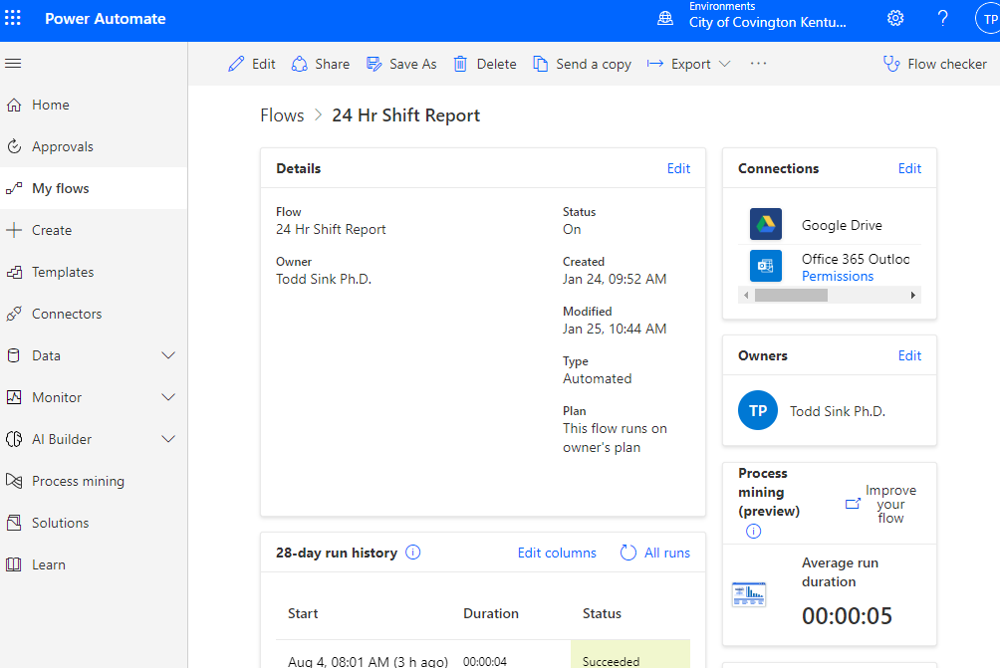
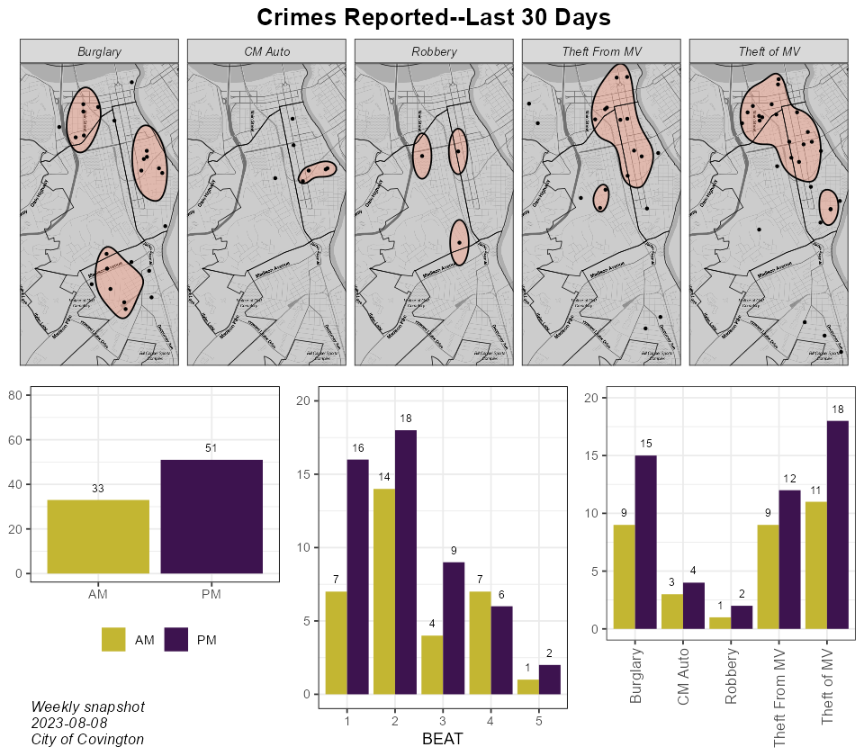

## README


<!-- TABLE OF CONTENTS -->
<details>
  <summary><b>Table of Contents</b></summary>
  <ol>
    <li><a href="#project">Project</a></li>
    <li><a href="#data-collection">Data Collection</a></li>
    <li><a href="#data-processing">Data Processing</a></li>
    <li><a href="#weekly-data-snapshot">Weekly Data Snapshot</a></li>
    <li><a href="#weekly-hotspot-models">Weekly Hotspot Models</a></li>
    <li><a href="#model-presentation">Model Presentation</a></li>
  </ol>
</details>


# Project


# Technology

-   Microsoft Power Automate
-   Google Drive
-   SQLite database engine
-   ArcGIS Pro
-   RStudio (64x bit needed to connect to library of tools in ArcGIS
    Pro)
-   ArcGIS Online

## R Packages

-   tidyverse
-   ggmap
-   sf
-   lubridate
-   ggpubr
-   arcgisbinding
-   RPyGeo (ArcGIS processing via Python)

# Data Collection

Every morning at 8:00 AM a shift report CSV containing the previous 24
hour police dispatches is received via automated email from the Kenton
County Kentucky Dispatch Center.

A Power Automate workflow was created to store the attached file in a Google Drive folder.



# Data Processing

The daily 24 hour shift report files are processed in the R script
**daily_24hr_shift_report.R** The script reads, cleans, filters,
formats, and adds new features and stores new spatial data files that
are needed to generate hot spot models and weekly snapshots of crimes.

# Products Distributed

### Weekly Data Snapshot

Every week the Police Department receives a snapshot of crimes reported
over the last 30 days. The snapshot provides insight into where criminal
activities have been most concentrated and if they have occurred more
during the day or night.

The weekly snapshot is created in the R script **weekly_snapshot.R**



### Optimal and Emerging Hotspots

# Creating Hotspots


## ArcGIS Pro

We connect to the library of tools in ArcGIS Pro inside of Rstudio

``` r
arcpy <- rpygeo_build_env(path = "C:/Program Files/ArcGIS/Pro/bin/Python/envs/arcgispro-py3/python.exe", 
                          overwrite = TRUE,
                          extensions = "Spatial")
```

## Emerging Hotspots

Create the space-time cubes

``` python
theft_cube = arcpy.env.workspace + "/vtheft_cube_weekly.nc"
arcpy.stpm.CreateSpaceTimeCube(theft_prj,         #Projected shapefile
                               theft_cube,        #Data cube
                               "Date",            #Time field
                               None,              #Template cube
                               "1 Weeks",         #Time step interval
                               "END_TIME",        #Time step alignment; how aggregation occurs
                               None, 
                               "1800 Feet",        #Size of bins to aggregate points
                               "Count SUM ZEROS", #Summary fields
                               "HEXAGON_GRID",    #The shape of the polygon mesh to aggregate points
                               None, None)
```

Perform the emerging hot spot analysis

``` python
theft_spot_path = arcpy.env.workspace + "/Weekly_Crime_Hotspot.gdb/VTheft_Analysis_Emerging_HotSpot"
with arcpy.EnvManager(scratchWorkspace = arcpy.env.workspace + "/Weekly_Crime_Hotspot.gdb", 
                      workspace = arcpy.env.workspace + "/Weekly_Crime_Hotspot.gdb"):
                      arcpy.stpm.EmergingHotSpotAnalysis(theft_cube,  #Space-time cube to use
                      "COUNT_SUM_ZEROS",                              #The analysis variable to use
                       theft_spot_path,                               #The output path
                       "1800 Feet",                                   #The size of the analysis area
                       2,                                             #Number of time-step intervals
                       None, 
                       "FIXED_DISTANCE",                              #Define spatial relationships
                       6,                                             #Number of spatial neighbors
                       "ENTIRE_CUBE")                                 #Define global window; 
                                                                      #looking at overall pattern in cube
```

Calculate a field to label the results of the emerging hot spot analysis

``` python
arcpy.management.CalculateField(theft_spot_path,                      #Emerging hotspot analysis output
                                "TYPE",                               #The field that will be updated
                                '"Theft-Motor Vehicle"',              #The update
                                "PYTHON3",                            #The type of expression to use
                                '',
                                "TEXT",                               #Data value type
                                "NO_ENFORCE_DOMAINS")        
        
```

Create a copy of each emerging hot spot output layer

``` python
arcpy.management.CopyFeatures(theft_spot_path,                #The emerging hot spot out to copy                 
          arcpy.env.workspace + "/VTheft_Emerging_Final.shp", #Where the output will be copied
          '', None, None, None)
```

Merge the emerging hot spot analysis layers

Keep on hexagons indicating a pattern is detected

### Optimal Hotspots

