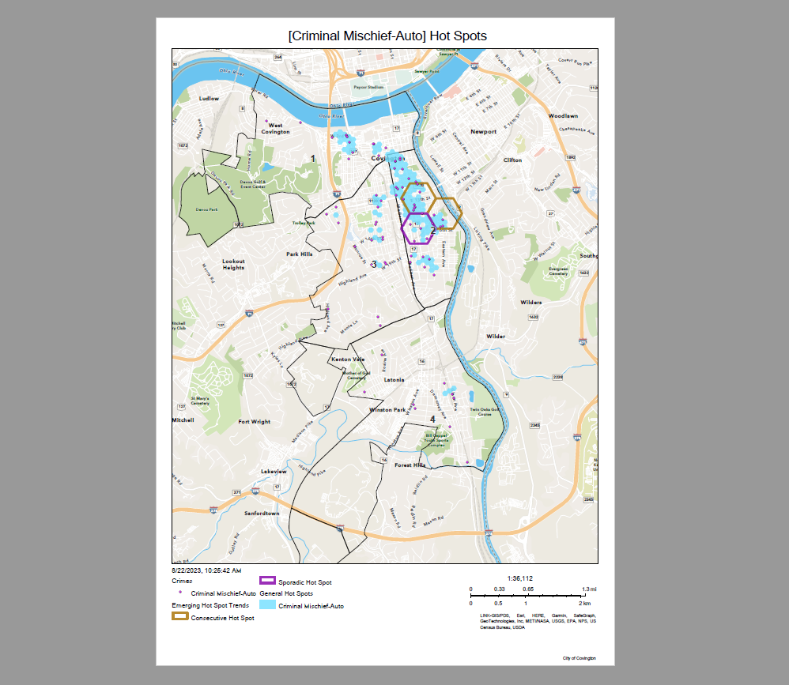

## README


<!-- TABLE OF CONTENTS -->

  <summary><b>Table of Contents</b></summary>
  <ol>
    <li><a href="#project-description">Project Description</a></li>
    <li><a href="#data-collection">Data Collection</a></li>
    <li><a href="#data-processing">Data Processing</a></li>
    <li><a href="#data-products">Data Products</a></li>
    <li><a href="#hot-spot-models">Hot Spot Models</a></li>
  </ol>


# Project


# Technology

-   Microsoft Power Automate
-   Google Drive
-   SQLite database engine
-   ArcGIS Pro
-   RStudio (64x bit needed to connect to library of tools in ArcGIS
    Pro)
-   ArcGIS Online

## R Packages

-   tidyverse
-   ggmap
-   sf
-   lubridate
-   ggpubr
-   arcgisbinding
-   RPyGeo (ArcGIS processing via Python)

# Data Collection

Every morning at 8:00 AM a shift report CSV containing the previous 24
hour police dispatches is received via automated email from the Kenton
County Kentucky Dispatch Center.

A Power Automate workflow was created to store the attached file in a Google Drive folder.


# Data Processing

The daily 24 hour shift report files are processed in the R script
**daily_24hr_shift_report.R** The script reads, cleans, filters,
formats, and adds new features and stores new spatial data files that
are needed to generate hot spot models and weekly snapshots of crimes.

# Data Products

### Weekly Data Snapshot

Every week the Police Department receives a snapshot of crimes reported
over the last 30 days. The snapshot provides insight into where criminal
activities have been most concentrated and if they have occurred more
during the day or night.

The weekly snapshot is created in the R script **weekly_snapshot.R**


### Optimal and Emerging Hotspots

In addition to the weekly data snapshot, the Police Departtment receives
map PDF files containing the results of the optimal and emerging hot
spot analyses. These files are generated within the internal web map
that is distributed on the City of Covington’s ArcGIS online platform.

-   Emerging Hot Spot Analysis – identifies trends in reported crimes,
    such as new, intensifying, diminishing, and sporadic hot and cold
    spots

-   Optimal Hot Spot Analysis – aggregates reported crimes into weighted
    features to yield optimal hot spot results.




# Hot Spot Models

## ArcGIS Pro

Connect to the library of tools in ArcGIS Pro inside of Rstudio using R
script **arcgispro_connection.R**

``` r
arcpy <- rpygeo_build_env(path = "...ArcGIS/Pro/bin/Python/envs/arcgispro-py3/python.exe", 
                          overwrite = TRUE,
                          extensions = "Spatial")
```

See the python script **hot_spot_script.py** for the complete code used
to run hot spot models

## Emerging Hot Spots

Create the space-time cubes

``` python
theft_cube = arcpy.env.workspace + "/vtheft_cube_weekly.nc"
arcpy.stpm.CreateSpaceTimeCube(theft_prj,         #Projected shapefile
                               theft_cube,        #Data cube
                               "Date",            #Time field
                               None,              #Template cube
                               "1 Weeks",         #Time step interval
                               "END_TIME",        #Time step alignment; how aggregation occurs
                               None, 
                               "1800 Feet",       #Size of bins to aggregate points
                               "Count SUM ZEROS", #Summary fields
                               "HEXAGON_GRID",    #The shape of the polygon mesh to aggregate points
                               None, None)
```

Perform the emerging hot spot analysis

``` python
theft_spot_path = arcpy.env.workspace + "/Weekly_Crime_Hotspot.gdb/VTheft_Analysis_Emerging_HotSpot"
with arcpy.EnvManager(scratchWorkspace = arcpy.env.workspace + "/Weekly_Crime_Hotspot.gdb", 
                      workspace = arcpy.env.workspace + "/Weekly_Crime_Hotspot.gdb"):
                      arcpy.stpm.EmergingHotSpotAnalysis(theft_cube,  #Space-time cube to use
                      "COUNT_SUM_ZEROS",                              #The analysis variable to use
                       theft_spot_path,                               #The output path
                       "1800 Feet",                                   #The size of the analysis area
                       2,                                             #Number of time-step intervals
                       None, 
                       "FIXED_DISTANCE",                              #Define spatial relationships
                       6,                                             #Number of spatial neighbors
                       "ENTIRE_CUBE")                                 #Define global window; 
                                                                      #looking at overall pattern in cube
```

## Optimized Hot Spots

Create minimum bounding box based on projected points

``` python
theft_box = arcpy.env.workspace + "/Weekly_Crime_Hotspot.gdb/theft_box"
arcpy.management.MinimumBoundingGeometry(theft_prj,     #Project shapefile
                                         theft_box,     #The output path
                                         "CONVEX_HULL", #The minimum bounding geometry
                                         "ALL",         #All points treated as one group
                                         None,
                                         "NO_MBG_FIELDS") 
```

Optimized hot spot masked to minimum bounding box of projected points

``` python
theft_hot_spot = arcpy.env.workspace + "/Weekly_Crime_Hotspot.gdb/Theft_OptimizedHotSpotAnalysis"
arcpy.stats.OptimizedHotSpotAnalysis(theft_prj,                                #Projected shapefile
                                     theft_hot_spot,                           #Output path
                                     None,                                     #Hot spots based on density
                                     "COUNT_INCIDENTS_WITHIN_HEXAGON_POLYGONS",#Aggregation method 
                                     theft_box,                                #Bounding box
                                     None, 
                                     None, 
                                     "300 Feet",                               #Hexagon size 
                                     "600 Feet")                               #Neighborhood size
```
