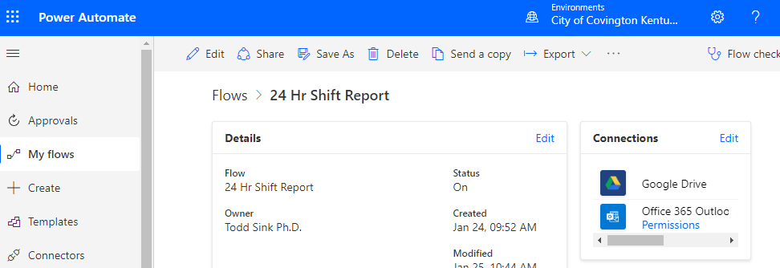

## README

<!-- TABLE OF CONTENTS -->

  
<b>Table of Contents</b>

  <ol>
    <li><a href="#project">Pision</a></li>
    <li><a href="#data-collection">Data Collection</a></li>
    <li><a href="#data-processing">Data Processing</a></li>
    <li><a href="#weekly-data-snapshot">Weekly Data Snapshot</a></li>
    <li><a href="#roadmap">Roadmap</a></li>
    <li><a href="#contact">Contact</a></li>
    <li><a href="#acknowledgments">Acknowledgments</a></li>
  </ol>

# Project

# Technology

-   Microsoft Power Automate
-   Google Drive
-   SQLite database engine
-   ArcGIS Pro
-   RStudio (64x bit needed to connect to library of tools in ArcGIS
    Pro)
-   ArcGIS Online

## R Packages

-   tidyverse
-   ggmap
-   sf
-   lubridate
-   ggpubr
-   arcgisbinding
-   RPyGeo (ArcGIS processing via Python)

# Data Collection

Every morning at 8:00 AM a shift report CSV containing the previous 24
hour police dispatches is received via automated email from the Kenton
County Kentucky Dispatch Center.

A Power Automate workflow was created to store the attached file in a Google Drive folder.

# Data Processing

# Weekly Data Snapshot

# Weekly Hotspot Models

# Model Presentation
